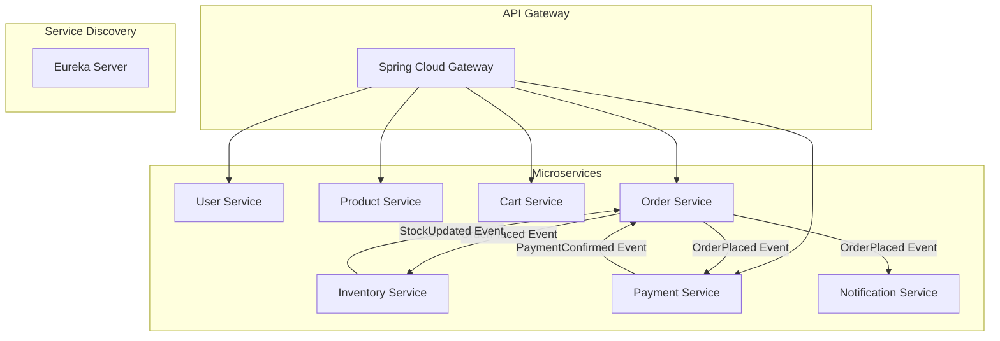

# 🛒 E-Commerce Microservices Platform  

A **Spring Boot & Spring Cloud based Microservices E-Commerce backend** with **JWT authentication, Kafka event-driven messaging, Redis caching, and Dockerized deployment**.  
This project is built to **go beyond CRUD** and introduce concepts like **microservices, async communication, service discovery, API Gateway, and observability**.  

---

## 📌 Features  

✅ User Authentication & Authorization (JWT)  
✅ Product Catalog with Search (Elasticsearch)  
✅ Shopping Cart with Redis Cache  
✅ Order Placement & Tracking  
✅ Payment Simulation (Stripe/PayPal optional)  
✅ Inventory Stock Management (event-driven updates)  
✅ Email Notifications (Spring Mail + Kafka consumer)  
✅ API Gateway (single entry point)  
✅ Service Discovery with Eureka  
✅ Centralized Configuration (Config Server)  
✅ Docker Compose for local deployment  
✅ Monitoring with Prometheus + Grafana  

---

## 🏗 Architecture  



---

## 🛠 Tech Stack  

### Core  
- **Spring Boot** – REST APIs  
- **Spring Cloud** – Eureka, Gateway, Config Server  
- **Spring Security + JWT** – authentication & authorization  
- **Spring Data JPA / Hibernate** – ORM  

### Databases & Caching  
- **PostgreSQL / MySQL** – relational data  
- **MongoDB** – optional product catalog flexibility  
- **Redis** – cache carts, sessions  
- **Elasticsearch** – product search  

### Messaging  
- **Kafka / RabbitMQ** – async event-driven communication  

### DevOps  
- **Docker & Docker Compose** – containerization  
- **Kubernetes (K8s)** – orchestration (future)  
- **Prometheus + Grafana** – metrics & dashboards  
- **ELK Stack (Elasticsearch, Logstash, Kibana)** – logging  

---

## 📂 Project Structure  

```
ecommerce-microservices/
│── config-server/           # Centralized configs
│── discovery-server/        # Eureka service discovery
│── api-gateway/             # Spring Cloud Gateway
│
│── user-service/            # Users, auth, JWT
│   ├── controller/
│   ├── service/
│   ├── repository/
│   └── model/
│
│── product-service/         # Product catalog, search
│── cart-service/            # Shopping cart (Redis)
│── order-service/           # Orders, status, events
│── payment-service/         # Payment simulation
│── inventory-service/       # Stock updates
│── notification-service/    # Emails, async consumers
│
│── common/                  # Shared DTOs, utils
│── docker-compose.yml       # Infra (DB, Kafka, Redis, ES)
│── README.md
```

---

## ⚡ Event Flow  

1. **User places an order** → `Order Service`  
2. `Order Service` publishes **OrderPlacedEvent** to Kafka  
3. **Inventory Service** consumes event → updates stock  
4. **Payment Service** consumes event → processes payment → publishes **PaymentConfirmedEvent**  
5. **Notification Service** consumes event → sends email confirmation  
6. **Order Service** updates status → PAID / FAILED  

---

## 🔑 Example APIs  

### 🔐 Auth (User Service)  
```http
POST /auth/register  
POST /auth/login → JWT token  
```

### 📦 Product Service  
```http
GET /products  
GET /products/search?q=laptop  
POST /products (Admin only)  
```

### 🛒 Cart Service  
```http
POST /cart/{userId}/add  
DELETE /cart/{userId}/remove/{productId}  
GET /cart/{userId}  
```

### 📑 Order Service  
```http
POST /orders → place order  
GET /orders/{id} → track order  
```

---

## 🚀 Getting Started  

### Prerequisites  
- Java 17+  
- Maven  
- Docker & Docker Compose  
- Kafka / RabbitMQ running locally  
- PostgreSQL, Redis installed  

### Installation  

```bash
# Clone repository
git clone https://github.com/yourusername/ecommerce-microservices.git
cd ecommerce-microservices

# Start infrastructure (DB, Kafka, Redis, Elasticsearch)
docker-compose up -d

# Build services
mvn clean install

# Run each microservice
cd user-service && mvn spring-boot:run
cd product-service && mvn spring-boot:run
...
```

---

## 📊 Monitoring  

- **Prometheus** → collect service metrics  
- **Grafana** → visualize dashboards  
- **Kibana** → analyze logs  

---

## 🎯 Learning Goals  

By building this project, you will learn:  
- ✅ How to build **microservices with Spring Boot & Spring Cloud**  
- ✅ How to use **Kafka/RabbitMQ** for event-driven communication  
- ✅ How to implement **caching with Redis**  
- ✅ How to integrate **Elasticsearch for search**  
- ✅ How to deploy using **Docker & Kubernetes**  
- ✅ How to add **observability (Prometheus, Grafana, ELK)**  

---

## 📌 Future Improvements  

- Add GraphQL APIs for product queries  
- Real payment gateway integration (Stripe/PayPal)  
- gRPC communication between services  
- CI/CD pipeline with GitHub Actions + Kubernetes  

---

## 📜 License  

This project is MIT Licensed – free to use and modify.  
